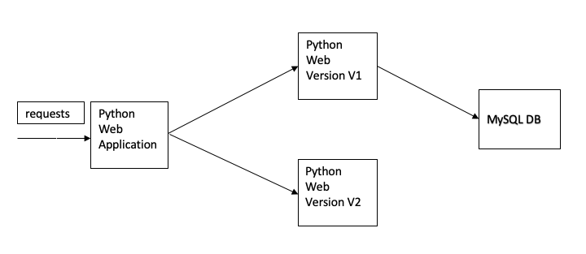

# istio-k8s
Istio Configuration with Sample K8s Application 

## Istio Installation

### Download Istio 

First download the istio on your machine with below command 
```
$ curl -L https://istio.io/downloadIstio | ISTIO_VERSION=1.7.1 TARGET_ARCH=x86_64 sh - 
```

Add the istioctl client to your path (Linux or macOS):
```
export PATH=$PWD/istio-1.7.1/bin:$PATH
```
### Install Istio

Run the below command to install the istio on your cluster with demo profile
`NOTE:` Demo Profile for testing, but there are other profiles for production or performance testing.

```
$ istioctl install --set profile=demo
```

Add a namespace label to instruct Istio to automatically inject Envoy sidecar proxies when you deploy your application later:

```
$ kubectl label namespace default istio-injection=enabled
```

## Deploy the Application

Python web application architecture 



Run the below command to install the python web application on your kubernetes cluster 

```
$ git clone https://github.com/angudadevops/istio-k8s.git

$ kubectl apply -f deployment.yaml
```

Above command will deploy the python web application wiht its service 

First install the gateway that will help to connect istio ingress 

```
$ kubectl apply -f python-gateway.yaml
```

Now install the destination rule to map the specific version as a subest

```
$ kubectl apply -f python-destination-rule.yaml
```

## Deploy Istio Rules 

Now it's time to descide what type of virtual service type you want to use, below are the available methods

- HTTP Based Routing 
- Weight Based routing 
- Fault Injection Routing

1. HTTP Based Routing 

Run the below command to install Http based routing with prefix and rewrite rules

```
$ kubectl apply -f python-http-prefix.yaml
```

2. Weight Based Routing 

Run the below command to install weight based routing, this method is for Blue Green or Canary based deployments

```
$ kubectl apply -f python-weight-based.yaml
```

3. Fault Injection Routing 

It's best practice to add fault injection for any application, as this will help you to wait and reroute the request to different prefix. 

```
$ kubectl apply -f python-fault-injection.yaml
```
